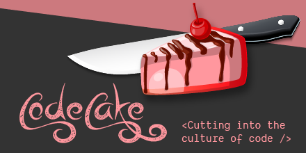

# CodeCake.tv

> _"Cutting into the culture of code"_

## Season 1: 'Half-baked solutions'

---

### Episode 1: 'Requirement Gathering' | 07-08-2020

Layla needs a cake for her birthday party and she contacted Salma who provides Cake-as-a-Service to help her out. Before we got started on the build process, we needed to gather a long list of requirements about the type of cake that was right for Layla and her party-goers in order to decide how to produce it.

Through a series of questions, discussion and informal chat, we gathered the requirements for Layla's cake.

### Overview

**Party date:** 1st September 2020 (this gives us 24 days from the date of this session)
**Event type:** Birthday party
**No. of guests at event:** 17
**Other contextual details:** Other food at the event will comprise sausage rolls, triangle egg sandwiches and 'plenty of drink'.

### Layla's personal requirements

"I would prefer it if there was no leftover food or cake after the party."

### Potential risks

The amount of alcohol at the party may directly correlate with the amount of cake that the party-goers would like to consume.

The party will be held in a garden. Current data shows us that 1st September in the UK may bring hot weather. The construction of the cake must seek to mitigate the risk of any part of the cake melting in the hot weather (regardless of whether the cake is presented in the shade or in the open).

Layla has specified she would like to transport the cake to the final party destinate on her bicycle. Layla has admitted she is a "wobbly and ineffective" cyclist.

### Constraints

£170 Budget - preferably under for client satisfaction

## Defining requirements

#### As a cake...

```
"...I must be transported safely without breakage on the back of a bicycle."

"...I must be fully assembled on arrival to Layla."

"...I should be gluten-free, yet palatable."
```

#### As a party-thrower

```
"...I don't want a lot of left-over cake after the party."
```

#### As a party attendee

N.B. Usually we would conduct usability interviews who may have been to Layla's previous parties in order to understand more about party attendee needs. Due to time constraints we are drawing upon Layla's previous experience of throwing parties for a similar group of guests to define these requirements.

```
"...I would like to consume the cake using my hands."

"...I would like to consume at least one portion of cake."

"...I would like the option to consume up to three portions of cake."

"...I am indifferent to the physical manifestation of the cake I eat."

"...I must be able to consume a portion of cake intravenously if I so wish."
```

### Problems we have identified

```
How might we produce a gluten-free, yet, palatable cake for a medium-sized birthday party in the sun, where we're unsure of how many people will eat the cake.

_HMW transport the cake safely given the transport and competency risks we have over the proposed cycling solution.
```

## Salma's vision: To provide Layla and her party attendeed with a postive birthday party experience featuring a cake.
