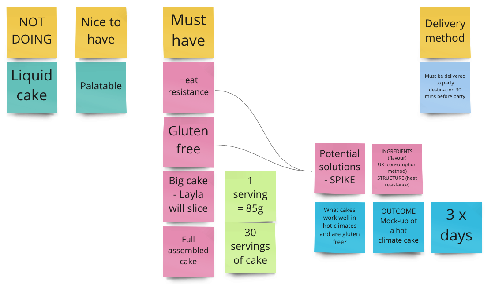

# CodeCake.tv

> _"Cutting into the culture of code"_

## Season 1: 'Half-baked solutions'

---

### Episode 2: 'Spiking Features' | 14-08-2020

After gathering the requirements for Layla's birthday party cake, we wanted to understand how we might go about building and delivering the cake to satisfy those requirements.

We discussed the notion of building up a bank of Acceptance Criteria in order to lay out how we would satisfy those requirements. However, it was important to understand a little bit more about what those requirements looked like next to each other, the dependencies of each requirements, and the order in which they might have to be considered, built and delivered.

## Spiking Features

We laid out our features on a Miro board using post it notes to help work out what dependencies there may be.

We made a series of decisions about what we should NOT DO at this time (i.e. liquid cake for intravenous cake eaters) due to the complexities imposed on the product. We also made the assumption that the cake needing to be 'palatable' was a 'NICE TO HAVE', given that a more valuable requirement was that the cake be gluten-free.

It soon transpired that before we could proceed any further, we needed to investigate how we might satisfy some of the high-value requirements, such as the need for the cake to be 'heat-resistant'.

We proposed that we moved forward by conducting a time-boxed SPIKE, or DESIGN SPRINT, where we would seek to understand what types of cake could withstand a potential heatwave.

[_Read more about Design Sprints here_](https://en.wikipedia.org/wiki/Design_sprint)

## Definition of done

We also wanted to be able to understand what our definition of DONE looked like in the context of our cake. However, due to the key interlinking dependencies of the structure of the cake, the ingredients of the cake and the overall user experience of the cake, we concluded that:

_We cannot define what we mean by 'done' until we understand what's 'possible'._

---

Thanks for joining us for our pilot season of CodeCake!
